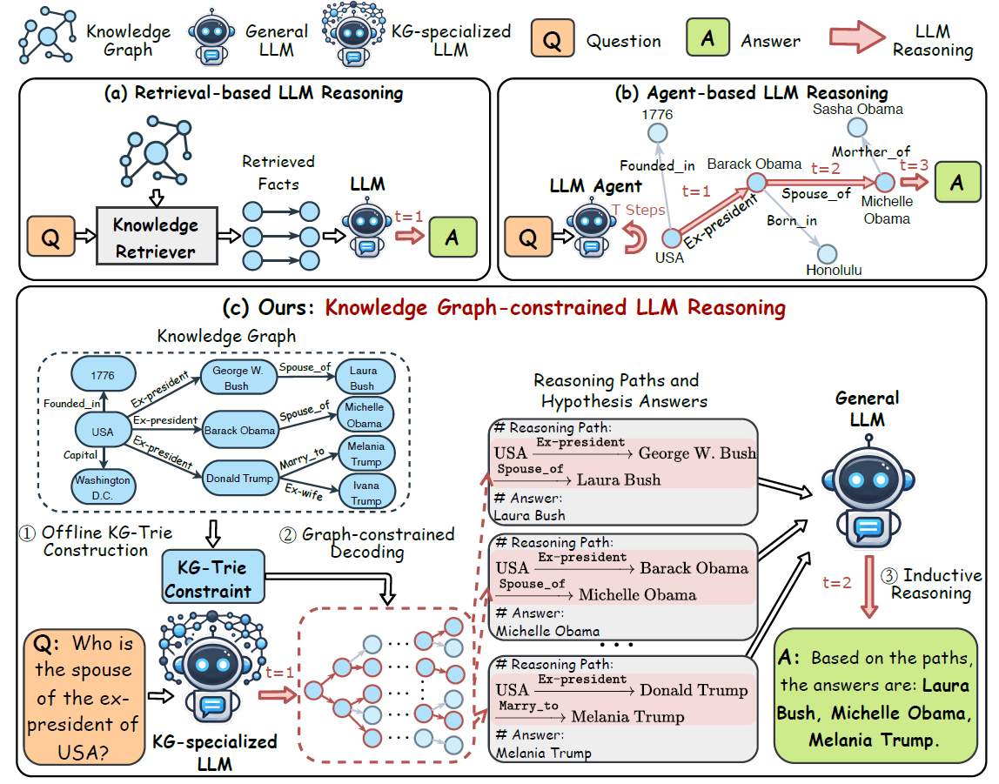
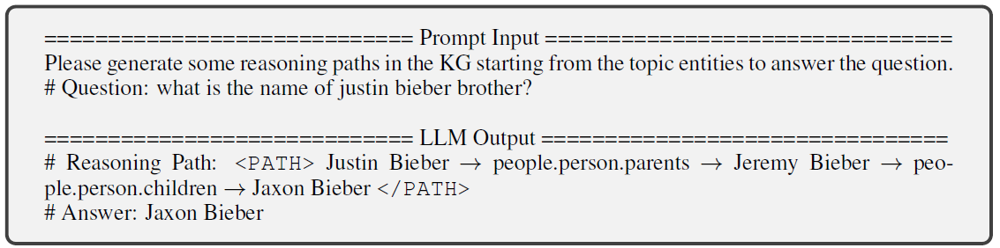
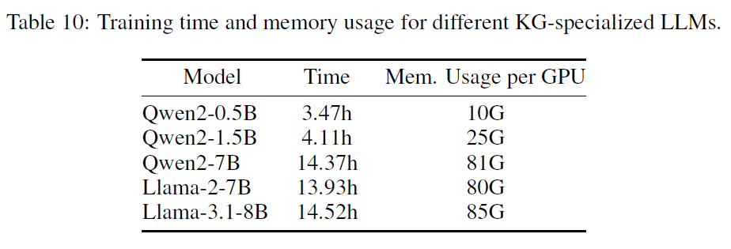
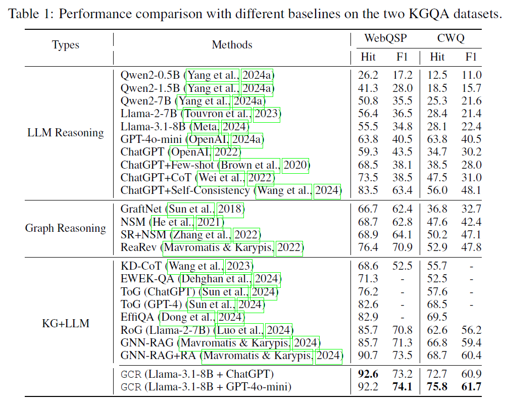
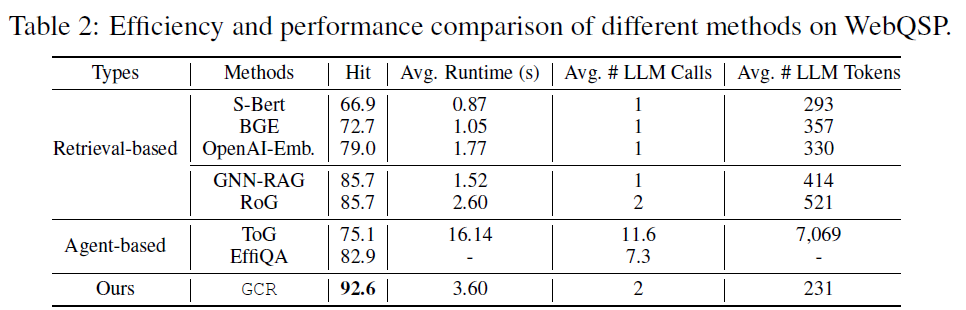
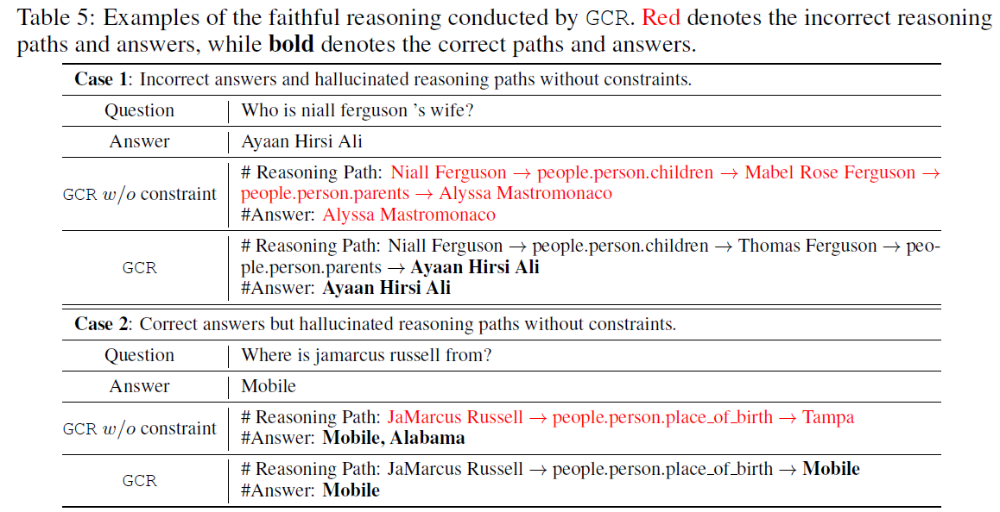

# 图约束推理 (GCR)

官方实现 "[图约束推理：基于知识图谱的大语言模型忠实推理](https://arxiv.org/abs/2410.13080)"。



图约束推理 (GCR) 是一种新颖的框架，它将知识图谱 (KG) 中的结构化知识与大语言模型 (LLM) 中的非结构化推理相结合。GCR 通过 KG-Trie 将 KG 结构集成到 LLM 的解码过程中，确保基于 KG 的忠实推理。这使得 LLM 能够直接在图上进行推理，并生成基于 KG 的忠实推理路径，从而实现零推理幻觉的准确推理。

## 依赖项

我们使用 [Poetry](https://python-poetry.org/) 来管理依赖项。推荐使用 CUDA 12.1。

步骤 1: 安装 `Poetry`   
`curl -sSL https://install.python-poetry.org | python3 -`

步骤 2: 创建一个 conda 环境并安装依赖项

```bash
conda create -n GCR python=3.12
conda activate GCR
poetry install
```

步骤 3: 安装 Flash-attention 以加速解码

```bash
pip install flash-attn --no-build-isolation
```

## 构建图索引

> [!NOTE]
> 我们的代码会自动从 Huggingface 下载数据。

为训练构建图索引：`scripts/build_graph_index.sh`

图索引将保存在：`data/graph_index`。

<details> <summary>[可选] 为评估构建图索引：</summary>

你可以预先构建图索引以加快评估速度。否则，评估脚本将即时构建图索引。   
```bash
DATA_PATH="RoG-webqsp RoG-cwq"
SPLIT=test
N_PROCESS=8
HOP=2 # 3
for DATA_PATH in ${DATA_PATH}; do
    python workflow/build_graph_index.py --d ${DATA_PATH} --split ${SPLIT} --n ${N_PROCESS} --K ${HOP}
done
```
</details>


## 训练轻量级 KG 专用 LLM

我们提供了在图上约束解码任务上微调轻量级 KG 专用 LLM 的训练脚本。 


在脚本中，我们提供了以下模型配置：`Qwen2-0.5B/1.5B/7B`、`Llama-2-7B` 和 `Llama-3.1-8B`。但它可以轻松扩展到其他 LLM。

取消注释相应的“模型配置块”（默认情况下为 Llama-3.1-8B）并运行脚本：`scripts/train_kg_specialized_llm.sh`。

模型将保存在：`save_models/${SAVE_NAME}`。

每种模型配置的训练资源和时间如下：
 

> [!NOTE]
> 我们提供了轻量级 KG 专用 LLM 的预训练权重：`Qwen2-0.5B`、`Llama-2-7B` 和 `Llama-3.1-8B`。你可以从[这里](https://huggingface.co/collections/rmanluo/graph-constrained-reasoning-671052e5c808aa5e8c57501a)找到预训练权重，并将其用于推理。

## 推理

### 步骤 1: 图约束解码

我们首先采用 KG 专用 LLM 生成多个基于 KG 的推理路径和假设答案，并使用束搜索。

> [!NOTE]
> 我们的代码会自动从 huggingface 下载模型权重。

运行：`scripts/graph_constrained_decoding.sh`

```bash
MODEL_PATH=rmanluo/GCR-Meta-Llama-3.1-8B-Instruct
MODEL_NAME=$(basename "$MODEL_PATH")

python workflow/predict_paths_and_answers.py \
  --data_path rmanluo \
  --d {RoG-webqsp,RoG-cwq} \
  --split test \
  --index_path_length 2 \
  --model_name ${MODEL_NAME} \
  --model_path ${MODEL_PATH} \
  --k 10 \
  --prompt_mode zero-shot \
  --generation_mode group-beam \
  --attn_implementation flash_attention_2
```
生成的推理路径和假设答案将保存在：`results/GenPaths/{dataset}/{model_name}/{split}`。

### 步骤 2: 图归纳推理

我们使用一个通用的 LLM 对多个推理路径和假设答案进行推理，以生成最终答案，而无需额外训练。

运行：`scripts/graph_inductive_reasoning.sh`

```bash
python workflow/predict_final_answer.py \
  --data_path rmanluo \
  --d {RoG-webqsp,RoG-cwq} \
  --split test \
  --model_name {gpt-3.5-turbo, gpt-4o-mini} \
  --reasoning_path {REASONING_PATH} \
  --add_path True \
  -n 10
```

> [!NOTE]
> 注意：你需要将你的 openai 密钥设置在 `.env` 中以使用 ChatGPT。

## 结果





## 引用信息
如果你觉得这个仓库有帮助，请通过引用这篇论文帮助我们：
```
@article{luo2024graph,
  title={图约束推理：基于知识图谱的大语言模型忠实推理},
  author={Luo, Linhao and Zhao, Zicheng and Gong, Chen and Haffari, Gholamreza and Pan, Shirui},
  journal={arXiv 预印本 arXiv:2410.13080},
  year={2024}
}
```